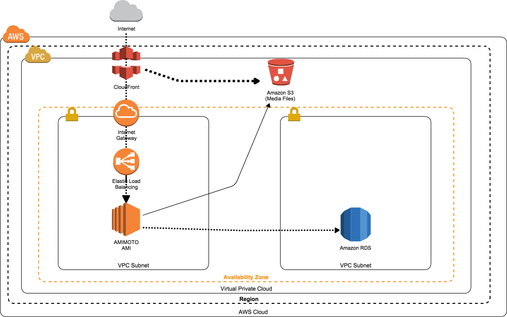

#WordPress powered by JINKEI
CloudFormation templates to create WordPress stack using AMIMOTO-AMI.

##Getting Start
You can use 2way.

+ Using on AWS Market Place
+ Using kumogata

##Using on AWS Market Place
Search "AMIMOTO" on AWS Market Place.  
More information -> https://speakerdeck.com/amimoto/how-to-use-jin-kei-aws-cloudformation-template  
Japanese -> https://speakerdeck.com/amimoto/ri-ben-yu-jin-kei-aws-cloudformation-tenpuretofalseshi-ifang

##Using kumogata( How to contribute )
Clone this repository.
```
$ git@github.com:megumiteam/amimoto-enterprise-cfn.git
$ bundle install
```

Set up "kumogata"
```
$ gem install kumogata
```

You can use kumogata commands.
http://kumogata.codenize.tools/

If you want to validate all templates.
```
$ /bin/bash validate.sh
```

If you want to convert all templates to JSON.
```
$ /bin/bash deploy.sh
```

If you want to make stack using kumogata
```
$ kumogata create \
 001-woo.rb {STACK_NAME} \
 -s {AWS_SECRET_KEY} -k {AWS_ACCESS_KEY} \
 -r  {REGION} \
 -p "KeyName={KEY_NAME},MySQLPassword={DBPASSWORD},MulitiAZDatabase={true / false},SSHLocation={SSH_LOCATION},SecondaryAvailabilityZone={SECONDARY_AZ},AvailabilityZone={PRIMARY_AZ}" \
  --capabilities=CAPABILITY_IAM
```

##Stack Information
###ID:001 "Simple Stack"
####Architecture


####Template List
[See Stack Type Wiki](https://github.com/amimoto-ami/amimoto-enterprise-cfn/wiki/Stack-Type)


##Relase Note
###Version1.2.1
- Auto Set-up nephila clavata Plugin

###Version1.0.1
- Update SecurityGroupIngress Setting
- Add Depends on "AttachGatewayToVPC"
 - AWS::ElasticLoadBalancing::LoadBalancer
 - AWS::RDS::DBSubnetGroup
- Remove DeletionPolicy
 - AWS::EC2::Subnet
 - AWS::EC2::RouteTable
 - AWS::EC2::SubnetRouteTableAssociation
 - AWS::EC2::InternetGateway
 - AWS::EC2::VPCGatewayAttachment
 - AWS::EC2::Route
 - AWS::EC2::VPC

## AMI IDs

```
$ bundle exec rake ami:map['AMIMOTO HVM 5*','hvm']
$ bundle exec rake ami:map['AMIMOTO*for AutoScaling*','as']
$ bundle exec rake ami:map['AMIMOTO MOD_PHP *','mod']
$ bundle exec rake ami:map['*Woo*HVM*','woo_hvm']
$ bundle exec rake ami:map['*Woo*MOD*','woo_mod']
```